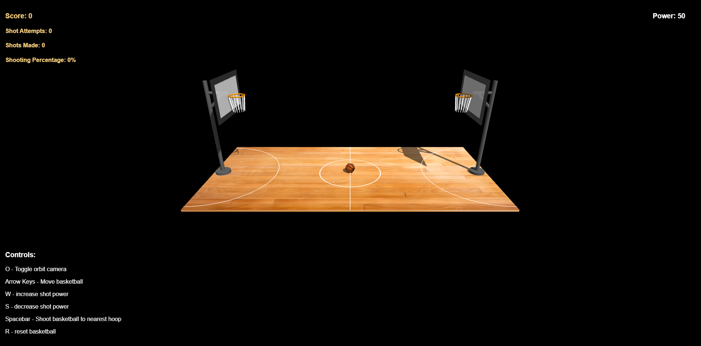

# Computer Graphics - Exercise 5 - WebGL Basketball Court

## Getting Started
1. Clone this repository to your local machine
2. Make sure you have Node.js installed
3. Start the local web server: `node index.js`
4. Open your browser and go to http://localhost:8000

## Complete Instructions
**All detailed instructions, requirements, and specifications can be found in:**
`basketball_exercise_instructions.html`

## Group Members
**MANDATORY: Add the full names of all group members here:**
- Stav Hirszowicz (id: 200973139)

## Running the implementation
- Run the server with: `node index.js`
- Access at http://localhost:8000 in your web browser

## Implemented controls:
- Arrow Keys - move basketball (left, right, up, down)
- Adjust shot power - w / s keys.
- Spacebar - shoot basketball
- R key - reset basketball
- O key - toggle camera

## Description of physics system implementation:

All physics system that were required in the mandatory part are implemented in the file src/ShotMachnism.js.
Your physics system must implement realistic basketball mechanics:

1. Gravity and Trajectory
- Constant downward acceleration (gravity = -9.8 m/s² or scaled equivalent)
- Parabolic trajectory for shot basketball
- Initial velocity components based on shot angle and power
- Realistic arc height for basketball shots

2. Collision Detection
- Ball-to-ground collision with bounce mechanics
- Ball-to-rim collision for successful shots
- Energy loss on each bounce (coefficient of restitution)
- Ball should come to rest after multiple bounces

3. Shot Mechanics
- Adjustable shot power affecting initial velocity
- Shot angle calculation based on basketball position relative to hoop
- Minimum arc height to clear rim for successful shots
- Ball must pass through hoop area for score detection

4. Rotation animation
- Add ball rotation during movement
- Implement rotation during flight
- Match rotation axis to movement direction
- Scale rotation speed with velocity

## Implementation:
- No additional features are implemented.
- Issues / limitations:
    - Must run using `node index.js` (as instructed)
    - Because I use external texture (https://piazza.com/class/m8cunlsk2i24ew/post/197),
    src folder must include the following two files (external textures for court and basketball, it is inside this repository):
        - court_texture.jpg
        - texture.jpg

# Screenshots:

Clicking on the screenshot will open better quality version of the picture

## View demonstrating functionality

<video src='./screenshots/Video.mkv' width=180></video>